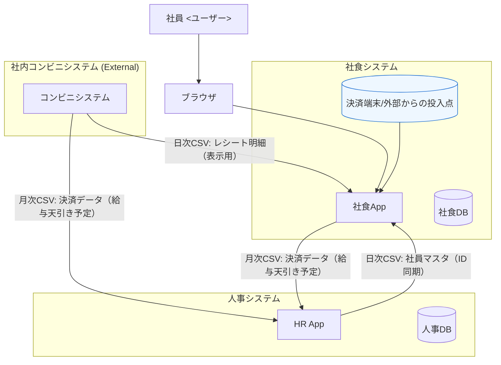

```mermaid
flowchart TB
%% ===== Nodes =====
User[社員 <ユーザー>]
Browser[ブラウザ]

subgraph Canteen["社食システム"]
  App[社食App]
  DB[(社食DB)]
  Ingest[(決済端末/外部からの投入点)]:::ing
end

subgraph HR["人事システム"]
  HRApp[HR App]
  HRDB[(人事DB)]
end

subgraph Store["社内コンビニシステム (External)"]
  POS[コンビニシステム]
end

%% 既存のCSV連携（維持）
POS -- 月次CSV: 決済データ（給与天引き予定） --> HRApp
POS -- 日次CSV: レシート明細（表示用） --> App
App -- 月次CSV: 決済データ（給与天引き予定） --> HRApp
HRApp -- 日次CSV: 社員マスタ（ID同期） --> App

%% ユーザーアクセス
User --> Browser
Browser --> App

%% システム連携
Ingest --> App

%% ===== Styles =====
classDef ing fill:#eef7ff,stroke:#1b6dd1,rx:6,ry:6;
```
