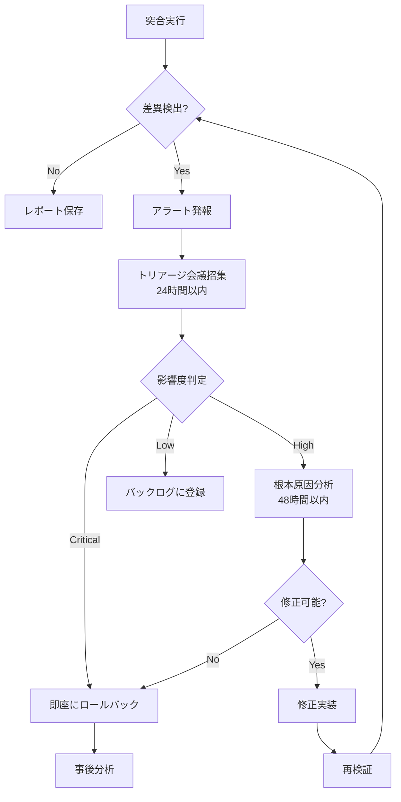

# Backcasting Review - Improvement Proposals

**Date**: 2025-11-13  
**Priority**: Critical & High items  
**Status**: Draft for Review

---

## Overview

このドキュメントは、Backcasting Mapクロスチェックで検出された問題点に対する具体的な改善提案を記載しています。以下の優先度で対応を推奨します：

- 🔴 **Critical**: 即座に対応すべき（Phase G開始前に必須）
- 🟡 **High**: Phase G開始前に対応すべき
- 🟢 **Medium**: Phase G中に対応可能

---

## 🔴 Critical Priority

### Proposal 1: DR戦略の策定

**対象**: Target Architecture (`03_arch-artifacts/target/container-diagram.md`)  
**Root Cause**: rc-019 (Insufficient DR testing), rc-030, rc-018  
**Symptom**: rf-006 (DR switchover failure)  
**Threatened Success Criteria**: sc-006 (Day 2 Operation Success)

#### 追加すべきセクション

Target Architectureに以下のセクションを追加してください：

```markdown
## Disaster Recovery Strategy

### Overview
本システムは給与天引き決済を扱うため、データロストや長時間のダウンタイムは業務に重大な影響を与える。以下のDR戦略により、事業継続性を確保する。

### RTO/RPO
- **RTO (Recovery Time Objective)**: 4 hours
  - 根拠: 給与天引きは月次締めのため、4時間以内の復旧であれば業務影響は最小限
- **RPO (Recovery Point Objective)**: 1 hour
  - 根拠: 昼ピーク時の取引データロストを1時間以内に抑える

### Backup Strategy

#### PostgreSQL
- **方式**: Continuous WAL (Write-Ahead Logging) archiving
- **保存先**: Object Storage (S3-compatible)
- **保持期間**: 
  - Daily backup: 30 days
  - Weekly backup: 3 months
  - Monthly backup: 1 year
- **バックアップタイミング**: 毎日深夜2:00（バッチ処理後）
- **暗号化**: AES-256 (at rest and in transit)

#### Kafka
- **方式**: Multi-region replication (MirrorMaker 2)
- **レプリケーション**: 3 replicas (異なるAvailability Zone)
- **保持期間**: 30 days
- **データ整合性**: Topic-level checksum validation

#### Application Configuration
- **方式**: GitOps (ArgoCD)
- **バックアップ**: Git repository (自動バックアップ)

### Failover Strategy

#### Architecture
- **構成**: Active-Standby
- **Primary Site**: Data Center A (Tokyo)
- **DR Site**: Data Center B (Osaka)
- **Replication**: 
  - PostgreSQL: Streaming replication (async)
  - Kafka: MirrorMaker 2 (async)
  - Object Storage: Cross-region replication

#### Failover Procedure
1. **Detection**: Monitoring system detects primary site failure
2. **Decision**: On-call engineer confirms failover necessity (within 15 min)
3. **Switchover**: 
   - Stop traffic to primary site (API Gateway config update)
   - Promote standby database to primary
   - Update DNS records (TTL: 60s)
   - Resume traffic to DR site
4. **Validation**: Smoke test on DR site
5. **Monitoring**: Enhanced monitoring for 24 hours

#### Failback Procedure
1. Restore primary site
2. Sync data from DR to primary (reverse replication)
3. Validate data consistency
4. Planned switchback during maintenance window

### DR Testing

#### Quarterly DR Switchover Test
- **Frequency**: Every quarter (Jan, Apr, Jul, Oct)
- **Scope**: 
  - Full failover to DR site
  - Run in production environment (off-peak hours)
  - Validate RTO/RPO compliance
- **Duration**: 4 hours (including failback)
- **Participants**: SRE, DBA, Application team, Business stakeholder

#### Annual Full Disaster Recovery Drill
- **Frequency**: Once per year
- **Scope**: 
  - Simulate complete data center failure
  - Test all recovery procedures
  - Validate backup restoration
  - Update runbooks based on lessons learned
- **Duration**: 1 day
- **Participants**: All teams + external stakeholders

### Monitoring & Alerting

#### Replication Lag Monitoring
- **Metric**: PostgreSQL replication lag
- **Threshold**: 
  - Warning: > 5 minutes
  - Critical: > 15 minutes
- **Action**: Alert on-call engineer

#### Backup Validation
- **Frequency**: Daily
- **Method**: Automated restore test to test environment
- **Validation**: 
  - Backup file integrity check
  - Sample data restoration
  - Application smoke test

### Runbooks
- DR Failover Runbook: `docs/runbooks/dr-failover.md`
- Backup Restoration Runbook: `docs/runbooks/backup-restore.md`
- DR Test Runbook: `docs/runbooks/dr-test.md`
```

#### Transition Architecture Step 5への追加

`03_arch-artifacts/transition/step-5-overview-decoupling-canteen-resources.md` に以下を追加：

```markdown
## DR Testing (Exit Criteria に追加)

### DR Readiness Validation
- DR Failover Runbook 完成
- Quarterly DR Switchover Test 実施（1回以上）
- RTO/RPO 達成確認
- DR Site での Smoke Test 合格
```

---

### Proposal 2: 外部システム連携の明示

**対象**: Target Architecture (`03_arch-artifacts/target/container-diagram.md`)  
**Root Cause**: rc-012 (External system dependencies not captured)  
**Symptom**: rf-003 (Capacity shortage)  
**Threatened Success Criteria**: sc-005 (Day 1 Operation Success)

#### 問題点
現在のTarget Architectureには、人事システムと社内コンビニシステムとの連携が図示されていません。

#### 改善提案

Container Diagramに以下の外部システムを追加：

```markdown
%% 外部システム
subgraph External["External Systems"]
  HRSystem[人事システム\n(HR App)]:::external
  ConvenienceStore[社内コンビニシステム\n(POS)]:::external
end

%% 外部システムとの連携
HRSystem -->|Produce: 社員マスタ変更イベント| Kafka
Kafka -->|Consume: 決済イベント| HRSystem

ConvenienceStore -->|Produce: コンビニ決済イベント| Kafka

%% スタイル
classDef external fill:#ffe6e6,stroke:#d32f2f,rx:6,ry:6;
```

#### データ連携仕様セクションの追加

```markdown
## External System Integration

### 人事システム (HR System)

#### Inbound: 社員マスタ変更イベント
- **Source**: 人事システム
- **Target**: Employee API (via Kafka)
- **Topic**: `hr.employee.events`
- **Format**: Avro
- **Schema**:
  ```json
  {
    "employee_id": "string",
    "name": "string",
    "department": "string",
    "employment_status": "enum[ACTIVE, INACTIVE, ON_LEAVE]",
    "updated_at": "timestamp"
  }
  ```
- **Frequency**: Real-time (CDC via Debezium)
- **Volume**: ~10 events/day (average), 100 events/day (peak during HR operations)

#### Outbound: 決済イベント
- **Source**: Bill API, Transaction API
- **Target**: 人事システム
- **Topic**: `canteen.billing.events`
- **Format**: Avro
- **Schema**:
  ```json
  {
    "billing_id": "string",
    "employee_id": "string",
    "period": "string (YYYY-MM)",
    "total_amount": "int",
    "transaction_count": "int",
    "created_at": "timestamp"
  }
  ```
- **Frequency**: Daily (batch at 2:00 AM)
- **Volume**: ~1000 events/day

### 社内コンビニシステム (Convenience Store)

#### Inbound: コンビニ決済イベント
- **Source**: 社内コンビニシステム
- **Target**: Transaction API (via Kafka)
- **Topic**: `convenience-store.payment.events`
- **Format**: Avro
- **Schema**:
  ```json
  {
    "transaction_id": "string",
    "employee_id": "string",
    "amount": "int",
    "items": "array<item>",
    "timestamp": "timestamp"
  }
  ```
- **Frequency**: Real-time
- **Volume**: ~500 transactions/day

### Error Handling
- **Retry Policy**: Exponential backoff (max 3 retries)
- **Dead Letter Queue**: `*.dlq` topic for failed messages
- **Monitoring**: Alert on DLQ message count > 10
```

---

### Proposal 3: データ検証方法の確定

**対象**: 
- `03_arch-artifacts/transition/step-1-overview-csv-to-kafka.md`
- `03_arch-artifacts/transition/step-2-overview-separating-payments.md`

**Root Cause**: rc-027 (Data verification method not defined)  
**Symptom**: rf-002 (Production data contamination)  
**Threatened Success Criteria**: sc-004 (Successful Migration)

#### 問題点
Step 1, 2で「突合プロセスを標準化」「突合頻度を明示し、自動化を**検討**」とあるが、具体的な検証方法が確定していません。

#### 改善提案: Step 1への追加

`step-1-overview-csv-to-kafka.md` の Mitigations セクションに以下を追加：

```markdown
## Data Verification Strategy (詳細)

### 検証スコープ

#### Phase 1: 並行稼働期間（最大3ヶ月）
- 旧経路（CSV）と新経路（Kafka）を並行稼働
- 日次で全件突合を実施

#### Phase 2: 新経路のみ（1ヶ月）
- 新経路（Kafka）のみで稼働
- サンプリング検証とビジネスメトリクス監視

### 検証対象データ

| データ種別 | 検証レベル | 検証頻度 | 許容差異 |
|-----------|----------|---------|---------|
| 決済履歴 | 全件突合 | 日次 | 0件 |
| ユーザー別日次合計 | 集計値突合 | 日次 | 0円 |
| ユーザー別月次合計 | 集計値突合 | 月次 | 0円 |
| トランザクション数 | カウント突合 | 日次 | 0件 |

### 検証方法

#### 1. 全件突合 (Record-level Verification)

**対象**: 決済履歴  
**方法**: トランザクションIDをキーに新旧システムのレコードを突合

```python
# 突合スクリプト (conceptual)
def verify_transaction_records(date):
    old_records = fetch_from_csv(date)
    new_records = fetch_from_kafka_topic(date)
    
    # IDでソート
    old_sorted = sort_by_id(old_records)
    new_sorted = sort_by_id(new_records)
    
    # 差分検出
    missing_in_new = old_sorted - new_sorted
    extra_in_new = new_sorted - old_sorted
    mismatched = []
    
    for old, new in zip(old_sorted, new_sorted):
        if old.id == new.id:
            if not records_match(old, new, tolerance=0):
                mismatched.append((old, new))
    
    return {
        "missing": missing_in_new,
        "extra": extra_in_new,
        "mismatched": mismatched
    }

def records_match(old, new, tolerance=0):
    # 金額、タイムスタンプ、ユーザーIDを比較
    return (
        old.amount == new.amount and
        abs(old.timestamp - new.timestamp) <= tolerance and
        old.employee_id == new.employee_id
    )
```

**出力**: 
- 差分レポート (CSV)
- 不整合がある場合はアラート発報

#### 2. 集計値突合 (Aggregation Verification)

**対象**: ユーザー別日次合計、月次合計  
**方法**: SQLクエリで集計し、新旧システムの結果を比較

```sql
-- 旧システム（CSV取込後のDB）
SELECT 
    employee_id,
    DATE(transaction_time) as date,
    SUM(amount) as total_amount,
    COUNT(*) as transaction_count
FROM old_transactions
WHERE DATE(transaction_time) = '2025-11-13'
GROUP BY employee_id, DATE(transaction_time);

-- 新システム（Kafka経由のDB）
SELECT 
    employee_id,
    DATE(transaction_time) as date,
    SUM(amount) as total_amount,
    COUNT(*) as transaction_count
FROM new_transactions
WHERE DATE(transaction_time) = '2025-11-13'
GROUP BY employee_id, DATE(transaction_time);

-- 差分検出
SELECT 
    COALESCE(o.employee_id, n.employee_id) as employee_id,
    o.total_amount as old_total,
    n.total_amount as new_total,
    (n.total_amount - o.total_amount) as diff
FROM old_aggregated o
FULL OUTER JOIN new_aggregated n
    ON o.employee_id = n.employee_id AND o.date = n.date
WHERE o.total_amount != n.total_amount
   OR o.total_amount IS NULL
   OR n.total_amount IS NULL;
```

#### 3. サンプリング検証 (Sample Verification)

**対象**: Phase 2（新経路のみ）でのビジネスロジック検証  
**方法**: ランダムサンプリング（1%）で詳細検証

```python
def sample_verification(date, sample_rate=0.01):
    all_transactions = fetch_transactions(date)
    sample = random.sample(all_transactions, int(len(all_transactions) * sample_rate))
    
    for tx in sample:
        # ビジネスルール検証
        assert tx.amount > 0, "Amount must be positive"
        assert tx.employee_id is not None, "Employee ID required"
        assert tx.timestamp <= now(), "Future timestamp not allowed"
        
        # データ整合性検証
        employee = fetch_employee(tx.employee_id)
        assert employee.status == "ACTIVE", "Employee must be active"
```

### 検証ツール

#### 主ツール: Apache Camel + DataSet Component
- **理由**: Step 3でCamelを使用するため、同じツールで統一
- **機能**: 
  - CSV vs Kafka Topic の突合
  - 集計値の比較
  - レポート生成

#### バックアップ: Python スクリプト
- **理由**: Camelで対応困難な複雑な突合ロジック
- **機能**: 
  - レコードレベルの詳細突合
  - 統計分析
  - 可視化

#### 監視ダッシュボード: Grafana
- **メトリクス**: 
  - 日次突合結果（OK/NG件数）
  - 差分件数の推移
  - 検証所要時間

### 不整合発生時の対応フロー



#### 影響度判定基準

| 影響度 | 定義 | 例 | 対応期限 |
|-------|------|----|---------| 
| Critical | 金額の不整合 | ユーザー請求額が異なる | 即座 |
| High | データ欠損 | トランザクションが欠落 | 48時間 |
| Medium | メタデータの不一致 | タイムスタンプのズレ（<1秒） | 1週間 |
| Low | 表示用データの不一致 | 商品名の表記ゆれ | バックログ |

### Exit Criteria（Phase 1→Phase 2移行条件）

- ✅ 連続30日間、差異0件
- ✅ 集計値突合：連続30日間、差異0円
- ✅ パフォーマンス：突合処理時間 < 30分/日
- ✅ 運用トレーニング完了
- ✅ ビジネス承認取得
```

#### 改善提案: Step 2への追加

`step-2-overview-separating-payments.md` の Mitigations セクションで、「検討」を削除し、以下に置き換え：

```markdown
### データ検証戦略

Step 1で確立したデータ検証方法を継続適用：
- **全件突合**: 日次（Mirror経由の新旧システム）
- **集計値突合**: 日次（ユーザー別決済合計）
- **サンプリング検証**: Phase 2で1%

詳細は `step-1-overview-csv-to-kafka.md` のData Verification Strategyを参照。

**Step 2固有の検証項目**:
- Mirror経由のデータ分岐が正しく動作しているか
  - PayApp (新マイクロサービス) への配信: 100%
  - 旧App-DB への配信: 100%
- 人事システムへのKafka配信が旧CSV連携と一致しているか
```

---

## 🟡 High Priority

### Proposal 4: キャパシティ計画の策定

**対象**: 
- Baseline Architecture (`03_arch-artifacts/baseline/functional-map.md`)
- Target Architecture (`03_arch-artifacts/target/container-diagram.md`)

**Root Cause**: rc-017 (Insufficient capacity planning), rc-011 (Baseline capacity not analyzed)  
**Symptom**: rf-003 (Capacity shortage)  
**Threatened Success Criteria**: sc-005 (Day 1 Operation Success)

#### Baselineへの追加

`03_arch-artifacts/baseline/functional-map.md` に以下のセクションを追加：

```markdown
## 現行システムの性能特性（Capacity Baseline）

### トラフィックパターン

#### 日次パターン
- **昼ピーク時間帯**: 11:30-13:00
- **ピーク時TPS**: 50 transactions/second
- **平均TPS（営業時間）**: 10 transactions/second
- **1日あたりトランザクション数**: ~2,000件

#### 月次パターン
- **月初**: 通常
- **月末（締め処理）**: バッチ処理による負荷増
  - バッチ処理時間: 2-3時間（深夜2:00-5:00）
  - 処理対象レコード数: ~40,000件/月

### リソース使用状況（現行システム）

#### アプリケーションサーバー
- **CPU使用率**: 平均30%、ピーク時60%
- **メモリ使用率**: 平均50% (4GB中2GB)
- **スレッド数**: 平均20、ピーク時50

#### データベース（PostgreSQL）
- **同時接続数**: 平均10、ピーク時30
- **ストレージ**: 50GB（3年分のデータ）
- **クエリ応答時間**: 
  - SELECT（単純）: p95 < 50ms
  - SELECT（JOIN多数）: p95 < 500ms
  - INSERT/UPDATE: p95 < 100ms

#### ネットワーク
- **帯域幅**: 平均5Mbps、ピーク時20Mbps
- **レイテンシ**: 
  - 社内ネットワーク: < 5ms
  - 外部システム（人事）: < 50ms

### 外部システム連携の性能

#### 人事システムとのCSV連携
- **ファイルサイズ**: 
  - 日次（社員マスタ）: ~1MB
  - 月次（決済データ）: ~5MB
- **転送時間**: < 1分
- **処理時間**: ~10分

#### コンビニシステムとのCSV連携
- **ファイルサイズ**: 
  - 日次（レシート明細）: ~2MB
  - 月次（決済データ）: ~3MB
- **転送時間**: < 1分
- **処理時間**: ~5分

### ユーザー数
- **社員総数**: 1,000人
- **社食利用者**: ~500人/日
- **コンビニ利用者**: ~300人/日
- **同時アクセスユーザー**: ピーク時200人
```

#### Target Architectureへの追加

`03_arch-artifacts/target/container-diagram.md` に以下のセクションを追加：

```markdown
## Capacity Planning

### Performance Requirements（非機能要件）

#### API応答時間（SLO）
| API | p95レイテンシ | p99レイテンシ |
|-----|-------------|-------------|
| Menu API | < 200ms | < 500ms |
| Payment API | < 300ms | < 800ms |
| Transaction API | < 200ms | < 500ms |
| Bill API | < 1s | < 2s |
| Employee API | < 200ms | < 500ms |
| History API | < 500ms | < 1s |

#### スループット要件
| サービス | 平均TPS | ピークTPS | 備考 |
|---------|--------|---------|------|
| Payment API | 10 | 100 | 昼ピーク時の決済処理 |
| Transaction API | 10 | 100 | 同上 |
| Menu API | 20 | 200 | 昼ピーク前の閲覧集中 |
| Employee API | 1 | 10 | 低頻度 |

### Resource Allocation

#### Pod Resource Requests & Limits

```yaml
# 例: Payment API
resources:
  requests:
    memory: "512Mi"
    cpu: "250m"
  limits:
    memory: "1Gi"
    cpu: "500m"

# HPA (Horizontal Pod Autoscaler)
minReplicas: 2
maxReplicas: 10
targetCPUUtilizationPercentage: 70
targetMemoryUtilizationPercentage: 80
```

| Service | Replicas (min/max) | Memory (req/limit) | CPU (req/limit) |
|---------|-------------------|-------------------|-----------------|
| Payment API | 2/10 | 512Mi/1Gi | 250m/500m |
| Transaction API | 2/10 | 512Mi/1Gi | 250m/500m |
| Menu API | 2/10 | 256Mi/512Mi | 100m/250m |
| Bill API | 1/3 | 512Mi/1Gi | 250m/500m |
| Employee API | 1/3 | 256Mi/512Mi | 100m/250m |
| History API | 1/3 | 256Mi/512Mi | 100m/250m |
| Private API | 1/3 | 256Mi/512Mi | 100m/250m |
| UserProfile API | 1/3 | 256Mi/512Mi | 100m/250m |

#### Database Connection Pool

```yaml
# PostgreSQL Connection Pool (per service)
PaymentDB:
  min_connections: 5
  max_connections: 20
  connection_timeout: 30s

TransactionDB:
  min_connections: 5
  max_connections: 20
  connection_timeout: 30s

# その他のDB: min 2, max 10
```

#### Kafka Configuration

```yaml
# Topic Configuration
topics:
  canteen.payment.events:
    partitions: 6  # 並列処理のため
    replication_factor: 3  # 可用性のため
    retention: 30d
    
  hr.employee.events:
    partitions: 3
    replication_factor: 3
    retention: 30d

# Consumer Configuration
consumer:
  max_poll_records: 500
  session_timeout: 30s
  fetch_min_bytes: 1024
```

### Scaling Strategy

#### Auto-scaling Triggers

| Metric | Scale-out Threshold | Scale-in Threshold |
|--------|-------------------|-------------------|
| CPU使用率 | > 70% (5分間継続) | < 30% (10分間継続) |
| メモリ使用率 | > 80% (5分間継続) | < 40% (10分間継続) |
| API Latency (p95) | > SLO × 1.5 (2分間継続) | < SLO × 0.5 (10分間継続) |
| Request Queue Length | > 100 | < 10 |

#### Scale-out Time
- **Target**: Pod起動から準備完了まで < 2分
- **Strategy**: 
  - コンテナイメージの事前プル
  - Readiness Probeの最適化
  - Connection Pool の Warm-up

### Load Testing Plan

#### Test Scenarios
1. **通常負荷テスト**: 平均TPS × 1.5倍、30分間
2. **ピーク負荷テスト**: ピークTPS × 1.2倍、15分間
3. **耐久テスト**: 平均TPS、8時間
4. **スパイクテスト**: 0→ピークTPS、瞬間的
5. **バッチ処理テスト**: 月次締め処理、40,000件

#### Success Criteria
- ✅ レイテンシがSLO以内
- ✅ エラー率 < 0.1%
- ✅ Auto-scalingが正常動作
- ✅ データベース接続プールが枯渇しない
- ✅ Kafka Consumer Lagが累積しない (< 1000 messages)
```

---

### Proposal 5: 運用アーキテクチャの明示

**対象**: Target Architecture (`03_arch-artifacts/target/container-diagram.md`)  
**Root Cause**: rc-024 (Operational architecture was not considered)  
**Symptom**: rf-004 (Design-induced operational risk), rf-007 (Extended troubleshooting)  
**Threatened Success Criteria**: sc-006 (Day 2 Operation Success)

#### Target Architectureへの追加

Container Diagramに以下を追加：

```markdown
%% Observability Platform
subgraph Observability["Observability Platform"]
  Prometheus[(Prometheus\nMetrics)]:::obs
  Grafana[Grafana\nDashboards]:::obs
  Loki[(Loki\nLogs)]:::obs
  Jaeger[(Jaeger\nTracing)]:::obs
  AlertManager[AlertManager]:::obs
end

%% Observabilityとの連携
Bill -.->|metrics| Prometheus
Employee -.->|metrics| Prometheus
History -.->|metrics| Prometheus
Menu -.->|metrics| Prometheus
Payment -.->|metrics| Prometheus
Private -.->|metrics| Prometheus
Transaction -.->|metrics| Prometheus
UserProfile -.->|metrics| Prometheus

Bill -.->|logs| Loki
Employee -.->|logs| Loki
%% ... (他のサービスも同様)

Bill -.->|traces| Jaeger
Payment -.->|traces| Jaeger
Transaction -.->|traces| Jaeger

Prometheus --> AlertManager
AlertManager -.->|notifications| ExternalAlertSystem[PagerDuty/Slack]:::external

classDef obs fill:#fff3e0,stroke:#ff9800,rx:6,ry:6;
```

新規セクション:

```markdown
## Observability Architecture

### Overview
マイクロサービス化により、システムの複雑性が増すため、包括的なObservability戦略を採用する。Three Pillars of Observability（Metrics、Logs、Traces）を実装。

### Metrics Collection

#### Platform: Prometheus + Grafana

#### Metrics Hierarchy

**Level 1: Infrastructure Metrics (OpenShift提供)**
- Node CPU/Memory usage
- Pod CPU/Memory usage
- Network I/O
- Disk I/O

**Level 2: Application Metrics (Spring Boot Actuator)**
- JVM metrics (heap, GC, threads)
- HTTP request metrics (rate, duration, errors)
- Database connection pool metrics
- Cache hit/miss ratio

**Level 3: Business Metrics (Custom)**
- Transaction count per service
- Payment success/failure rate
- Average transaction amount
- Daily active users

#### Key Metrics (SLIs)

| Service | Metric | Target (SLO) | Alert Threshold |
|---------|--------|-------------|----------------|
| Payment API | Availability | 99.5% | < 99% (5 min) |
| Payment API | Latency (p95) | < 300ms | > 450ms (2 min) |
| Payment API | Error Rate | < 0.5% | > 1% (2 min) |
| Transaction API | Availability | 99.5% | < 99% (5 min) |
| Transaction API | Latency (p95) | < 200ms | > 300ms (2 min) |
| Kafka | Consumer Lag | < 1000 msgs | > 5000 msgs (5 min) |
| PostgreSQL | Connection Pool | < 80% utilized | > 90% (2 min) |

### Log Aggregation

#### Platform: Loki + Grafana

#### Log Levels & Retention

| Level | Use Case | Retention | Storage |
|-------|----------|-----------|---------|
| ERROR | エラー、例外 | 90 days | Hot |
| WARN | 警告、リトライ | 30 days | Warm |
| INFO | 主要イベント | 14 days | Warm |
| DEBUG | デバッグ情報 | 7 days | Cold |

#### Structured Logging Format (JSON)

```json
{
  "timestamp": "2025-11-13T12:34:56.789Z",
  "level": "INFO",
  "service": "payment-api",
  "trace_id": "a1b2c3d4e5f6",
  "span_id": "123456",
  "user_id": "emp001",
  "message": "Payment processed successfully",
  "context": {
    "transaction_id": "tx-12345",
    "amount": 850,
    "payment_method": "payroll_deduction"
  }
}
```

#### Log Query Examples

```logql
# 過去1時間のエラーログ（Payment API）
{service="payment-api"} |= "ERROR" | json | timestamp > now() - 1h

# 特定ユーザーのトランザクション追跡
{service=~"payment-api|transaction-api"} | json | user_id="emp001"

# 高レイテンシのリクエスト
{service="payment-api"} | json | duration > 1000
```

### Distributed Tracing

#### Platform: Jaeger

#### Trace Propagation
- **Protocol**: OpenTelemetry (OTLP)
- **Context Propagation**: W3C Trace Context headers
- **Sampling Rate**: 
  - Production: 10% (通常時), 100% (エラー発生時)
  - Non-production: 100%

#### Trace Example Flow

```
User Request → API Gateway → Payment API → Transaction API → PostgreSQL
                                   ↓
                                 Kafka → Bill API → PostgreSQL
```

各スパン:
- `api-gateway`: HTTP request handling
- `payment-api`: Payment validation
- `transaction-api`: Transaction creation
- `postgres`: Database query
- `kafka-producer`: Message publishing
- `kafka-consumer`: Message consumption
- `bill-api`: Bill generation

### Alerting Strategy

#### Alert Routing

```yaml
# AlertManager Configuration
route:
  receiver: 'team-canteen'
  group_by: ['alertname', 'service']
  group_wait: 30s
  group_interval: 5m
  repeat_interval: 4h
  
  routes:
    - match:
        severity: critical
      receiver: 'pagerduty-critical'
      continue: true
    
    - match:
        severity: warning
      receiver: 'slack-warnings'

receivers:
  - name: 'pagerduty-critical'
    pagerduty_configs:
      - service_key: '<key>'
  
  - name: 'slack-warnings'
    slack_configs:
      - channel: '#canteen-alerts'
```

#### Alert Examples

**Critical Alerts** (PagerDuty)
- API Availability < 99% for 5 minutes
- Error Rate > 5% for 2 minutes
- Database Connection Pool > 95% for 2 minutes
- Kafka Consumer Lag > 10,000 messages for 5 minutes

**Warning Alerts** (Slack)
- API Latency (p95) > SLO × 1.5 for 5 minutes
- Error Rate > 1% for 5 minutes
- Pod CPU > 80% for 10 minutes
- Disk Usage > 80%

### Dashboards

#### Level 1: Overview Dashboard (経営層向け)
- 日次トランザクション数
- 決済成功率
- システム可用性
- 主要メトリクスのステータス（Green/Yellow/Red）

#### Level 2: Service Dashboard (SRE向け)
- Per-service metrics (availability, latency, error rate)
- Resource utilization (CPU, memory)
- Dependency health (database, Kafka)
- Alert history

#### Level 3: Deep-dive Dashboard (開発者向け)
- Detailed trace analysis
- Database query performance
- Kafka consumer lag
- JVM metrics (heap, GC, threads)

### Runbook Integration
- 各アラートに対応するRunbookへのリンクを記載
- Runbook location: `docs/runbooks/`
- 例:
  - `runbooks/payment-api-high-latency.md`
  - `runbooks/kafka-consumer-lag.md`
  - `runbooks/database-connection-pool-exhausted.md`
```

---

## 🟢 Medium Priority

### Proposal 6: サブシステム間のData Contractの明示

**対象**: Transition Architecture (Step 1-5)  
**Root Cause**: rc-028 (Integration assumptions were inconsistent)  
**Symptom**: rf-003 (Capacity shortage), rf-012 (Numerous bugs occurred)

#### 各ステップに「Data Contract」セクションを追加

**Step 1**: `step-1-overview-csv-to-kafka.md`

```markdown
## Data Contract

### Kafka Topics

#### `canteen.transaction.events` (新規作成)
**Purpose**: 社食システムから決済トランザクションを配信

**Schema** (Avro):
```avro
{
  "type": "record",
  "name": "TransactionEvent",
  "namespace": "com.example.canteen",
  "fields": [
    {"name": "transaction_id", "type": "string", "doc": "トランザクション固有ID"},
    {"name": "employee_id", "type": "string", "doc": "社員ID"},
    {"name": "amount", "type": "int", "doc": "決済金額（円）"},
    {"name": "transaction_type", "type": "enum", "symbols": ["CANTEEN", "CONVENIENCE_STORE"]},
    {"name": "items", "type": {"type": "array", "items": "LineItem"}, "doc": "明細"},
    {"name": "timestamp", "type": "long", "logicalType": "timestamp-millis"}
  ]
}

{
  "type": "record",
  "name": "LineItem",
  "namespace": "com.example.canteen",
  "fields": [
    {"name": "item_id", "type": "string"},
    {"name": "item_name", "type": "string"},
    {"name": "quantity", "type": "int"},
    {"name": "unit_price", "type": "int"},
    {"name": "subtotal", "type": "int"}
  ]
}
```

**Configuration**:
- Partitions: 3
- Replication Factor: 3
- Retention: 30 days
- Compression: snappy

**Performance Requirements**:
- Throughput: 平均10 msg/s, ピーク100 msg/s
- Latency (Producer): p95 < 50ms
- Latency (Consumer): p95 < 200ms

---

#### `hr.employee.events` (既存、人事システムから配信)
**Purpose**: 人事システムから社員マスタ変更を配信

**Schema** (Avro):
```avro
{
  "type": "record",
  "name": "EmployeeEvent",
  "namespace": "com.example.hr",
  "fields": [
    {"name": "employee_id", "type": "string"},
    {"name": "name", "type": "string"},
    {"name": "department", "type": "string"},
    {"name": "employment_status", "type": "enum", "symbols": ["ACTIVE", "INACTIVE", "ON_LEAVE"]},
    {"name": "updated_at", "type": "long", "logicalType": "timestamp-millis"},
    {"name": "event_type", "type": "enum", "symbols": ["CREATE", "UPDATE", "DELETE"]}
  ]
}
```

**Configuration**:
- Partitions: 1 (低頻度のため)
- Replication Factor: 3
- Retention: 90 days
- Compression: snappy

**Performance Requirements**:
- Throughput: 平均1 msg/day, ピーク10 msg/day
- Latency (Consumer): p95 < 1s
```

**Step 2**: `step-2-overview-separating-payments.md`

```markdown
## Data Contract

### Mirror Configuration
**Input**: 決済端末からのデータ（フォーマット未定、プロジェクト依存）
**Output**: 
1. PayApp (新マイクロサービス) - Kafka経由
2. 旧App-DB - 直接書込み

### Kafka Topic (新規作成)

#### `canteen.payment.raw.events`
**Purpose**: 決済端末からの生データをMirrorが配信

**Schema** (Avro):
```avro
{
  "type": "record",
  "name": "PaymentRawEvent",
  "namespace": "com.example.canteen",
  "fields": [
    {"name": "terminal_id", "type": "string"},
    {"name": "employee_id", "type": "string"},
    {"name": "amount", "type": "int"},
    {"name": "timestamp", "type": "long", "logicalType": "timestamp-millis"},
    {"name": "raw_data", "type": "bytes", "doc": "端末からの生データ（将来の拡張用）"}
  ]
}
```

**Configuration**:
- Partitions: 6
- Replication Factor: 3
- Retention: 30 days

### REST API Contract (PayApp → HR System)

#### Endpoint: `POST /api/v1/billing/events`
**Purpose**: 人事システムへの決済イベント配信（Kafka経由の非同期処理）

**Request Body** (JSON):
```json
{
  "billing_id": "bill-2025-11-13-001",
  "employee_id": "emp001",
  "period": "2025-11",
  "total_amount": 12500,
  "transaction_count": 15,
  "created_at": "2025-11-13T02:00:00Z"
}
```

**Response** (HTTP 202 Accepted):
```json
{
  "status": "accepted",
  "message_id": "kafka-msg-12345"
}
```

**Error Handling**:
- 4xx: Client error (validation failure) → Retry不要、アラート発報
- 5xx: Server error → Exponential backoff retry (max 3回)
```

---

### Proposal 7: テスト戦略の明示

**対象**: Target Architecture (`03_arch-artifacts/target/container-diagram.md`)  
**Root Cause**: rc-020 (Insufficient testability strategy)  
**Symptom**: rf-012 (Numerous bugs occurred)

#### Target Architectureへの追加

```markdown
## Testing Strategy

### Test Pyramid

```
         /\
        /E2E\          10% - End-to-End Tests
       /______\
      /        \
     / Integr. \       20% - Integration Tests
    /___________\
   /             \
  /  Unit Tests   \    70% - Unit Tests
 /_________________\
```

### Test Types

#### Unit Tests (70%)
**Scope**: 単一クラス/関数のロジック  
**Framework**: JUnit 5 + Mockito  
**Coverage Target**: 80% (line coverage)  
**Execution Time**: < 5 minutes (全テスト)

**Example**:
```java
@Test
void shouldCalculateTotalAmount() {
    // Given
    List<LineItem> items = List.of(
        new LineItem("item1", 100, 2),
        new LineItem("item2", 150, 1)
    );
    
    // When
    int total = PaymentService.calculateTotal(items);
    
    // Then
    assertEquals(350, total);
}
```

#### Integration Tests (20%)
**Scope**: マイクロサービス内の複数コンポーネント統合  
**Framework**: 
- Spring Boot Test (with `@SpringBootTest`)
- Testcontainers (PostgreSQL, Kafka)

**Coverage Target**: 主要なビジネスフロー  
**Execution Time**: < 15 minutes

**Example**:
```java
@SpringBootTest
@Testcontainers
class PaymentAPIIntegrationTest {
    @Container
    static PostgreSQLContainer postgres = new PostgreSQLContainer("postgres:15");
    
    @Container
    static KafkaContainer kafka = new KafkaContainer("confluentinc/cp-kafka:7.5.0");
    
    @Test
    void shouldProcessPaymentAndPublishEvent() {
        // Given
        PaymentRequest request = new PaymentRequest("emp001", 850);
        
        // When
        PaymentResponse response = paymentAPI.processPayment(request);
        
        // Then
        assertEquals("SUCCESS", response.getStatus());
        
        // Verify Kafka message published
        ConsumerRecord<String, String> record = kafkaConsumer.poll(Duration.ofSeconds(5));
        assertNotNull(record);
        assertEquals("emp001", record.key());
    }
}
```

#### Contract Tests (重要)
**Scope**: マイクロサービス間のAPI契約検証  
**Framework**: Pact  
**Coverage Target**: 全APIエンドポイント

**Purpose**: 
- Consumer（呼び出し側）とProvider（提供側）の契約不一致を防ぐ
- デプロイ前に互換性を検証

**Example** (Consumer側):
```java
@Pact(consumer = "LunchApp", provider = "PaymentAPI")
public RequestResponsePact createPaymentPact(PactDslWithProvider builder) {
    return builder
        .given("user emp001 exists")
        .uponReceiving("a request to create payment")
            .path("/api/v1/payments")
            .method("POST")
            .body(new PactDslJsonBody()
                .stringType("employee_id", "emp001")
                .integerType("amount", 850))
        .willRespondWith()
            .status(201)
            .body(new PactDslJsonBody()
                .stringType("payment_id", "pay-12345")
                .stringType("status", "SUCCESS"))
        .toPact();
}
```

**Example** (Provider側):
```java
@SpringBootTest
@Provider("PaymentAPI")
@PactBroker
class PaymentAPIProviderTest {
    @TestTemplate
    @ExtendWith(PactVerificationInvocationContextProvider.class)
    void pactVerificationTestTemplate(PactVerificationContext context) {
        context.verifyInteraction();
    }
    
    @State("user emp001 exists")
    void userExists() {
        // Setup test data
        employeeRepository.save(new Employee("emp001", "John Doe"));
    }
}
```

#### End-to-End Tests (10%)
**Scope**: ユーザーシナリオ全体（UI → API → DB → Kafka）  
**Framework**: 
- Selenium/Playwright (UI自動化)
- REST Assured (API自動化)

**Coverage Target**: 主要なユーザージャーニー  
**Execution Time**: < 30 minutes

**Example Scenarios**:
1. 社員がメニューを閲覧し、決済を実行し、利用明細を確認する
2. 人事担当者が月次請求データを確認する
3. 決済失敗時のエラーハンドリング

### Test Environments

| Environment | Purpose | Data | Refresh Frequency |
|------------|---------|------|------------------|
| Local | 開発中のユニット/統合テスト | Mock/Testcontainers | 都度 |
| Dev | 開発チーム統合 | Synthetic | Daily |
| Test | QA検証 | Anonymized Production Data | Weekly |
| Staging | 本番前検証 | Anonymized Production Data | On-demand |
| Production | 本番 | Real Data | N/A |

### Continuous Testing (CI/CD)

```yaml
# CI Pipeline (.gitlab-ci.yml example)
stages:
  - unit-test
  - integration-test
  - contract-test
  - e2e-test
  - deploy

unit-test:
  stage: unit-test
  script:
    - ./gradlew test
  coverage: '/Code coverage: \d+\.\d+%/'
  
integration-test:
  stage: integration-test
  services:
    - postgres:15
    - confluentinc/cp-kafka:7.5.0
  script:
    - ./gradlew integrationTest

contract-test:
  stage: contract-test
  script:
    - ./gradlew pactVerify
  only:
    - merge_requests

e2e-test:
  stage: e2e-test
  environment: test
  script:
    - ./gradlew e2eTest
  only:
    - main
```

### Test Data Management

#### Synthetic Data Generation
**Tool**: Faker, DataFactory  
**Purpose**: ユニット/統合テスト用の偽データ生成

#### Anonymized Production Data
**Tool**: PostgreSQL Anonymizer  
**Purpose**: Test/Staging環境での realistic なデータ  
**Process**:
1. 本番DBのスナップショット取得
2. PII（個人情報）のマスキング
   - 氏名 → ランダム名前
   - 社員ID → ハッシュ化
   - 金額 → ノイズ付加（±10%）
3. Test/Staging環境への復元

### Testability Design Principles

1. **Dependency Injection**: モック/スタブの注入が容易
2. **Interface Segregation**: 小さなインターフェースで依存を分離
3. **Test Doubles**: モック、スタブ、フェイクの活用
4. **Idempotency**: 同じ入力で同じ結果（再現性）
5. **Observability**: テスト実行時のログ・メトリクス出力

### Test Metrics & Quality Gates

| Metric | Target | Enforcement |
|--------|--------|-------------|
| Unit Test Coverage | > 80% | CI/CD Block |
| Integration Test Coverage | > 60% | CI/CD Warning |
| Contract Test Coverage | 100% (all APIs) | CI/CD Block |
| E2E Test Success Rate | 100% | CI/CD Block |
| Test Execution Time | < 20 min (total) | CI/CD Warning |
```

---

### Proposal 8: Deployment Strategyの明示

**対象**: Target Architecture (`03_arch-artifacts/target/container-diagram.md`)  
**Root Cause**: rc-002 (Upgradeability not considered)  
**Symptom**: rf-005 (Security incident), rf-008 (Unable to accommodate business needs)

#### Target Architectureへの追加

```markdown
## Deployment Strategy

### Deployment Patterns

#### Blue-Green Deployment（本番デプロイ）
**Use Case**: メジャーバージョンアップ、破壊的変更  
**Process**:
1. Green環境（新バージョン）をデプロイ
2. Smoke testをGreen環境で実行
3. トラフィックをBlue→Greenに切替（DNS/Load Balancer）
4. 監視強化（Hypercare 24時間）
5. 問題なければBlue環境を廃棄

**Rollback**: トラフィックをGreen→Blueに戻す（< 1分）

---

#### Canary Deployment（段階的ロールアウト）
**Use Case**: マイナーバージョンアップ、新機能追加  
**Process**:
1. 新バージョンを10%のPodにデプロイ
2. 10%のトラフィックを新バージョンにルーティング
3. メトリクス監視（エラー率、レイテンシ）
4. 問題なければ段階的に50% → 100%へ
5. 旧バージョンのPodを削除

**Canary Analysis Metrics**:
- Error Rate: 新 vs 旧で有意差なし
- Latency (p95): 新 vs 旧で+10%以内
- Business Metrics: トランザクション成功率が同等

**Rollback**: 新バージョンへのトラフィックを0%に（< 5分）

---

#### Rolling Update（通常の更新）
**Use Case**: パッチ適用、設定変更  
**Process**:
1. 1 Pod ずつ新バージョンに更新
2. Readiness Probeで準備完了を確認
3. 次のPodへ進む
4. 全Podが新バージョンになるまで繰り返し

**Configuration** (Kubernetes):
```yaml
spec:
  strategy:
    type: RollingUpdate
    rollingUpdate:
      maxUnavailable: 1
      maxSurge: 1
```

### Version Management

#### Semantic Versioning
**Format**: `MAJOR.MINOR.PATCH`  
**Example**: `1.2.3`

- **MAJOR**: 破壊的変更（API契約の変更）
- **MINOR**: 後方互換性のある機能追加
- **PATCH**: バグ修正、セキュリティパッチ

#### Container Image Tagging
```
registry.example.com/canteen/payment-api:1.2.3
                      ^service  ^app     ^version
```

**Tag Strategy**:
- `1.2.3`: Immutable, specific version
- `1.2`: Latest patch in 1.2.x
- `1`: Latest minor in 1.x.x
- `latest`: Latest version (non-production only)

### Database Migration Strategy

#### Expand-Contract Pattern（後方互換性を保つ）

**Phase 1: Expand（拡張）**
- 新しいカラム/テーブルを追加
- 旧カラムは維持
- アプリケーションは新旧両方に書込み

**Phase 2: Migrate（移行）**
- データを旧カラムから新カラムへ移行
- バックフィルスクリプト実行

**Phase 3: Contract（縮小）**
- 旧カラムへの参照を削除
- アプリケーションデプロイ
- 旧カラムを削除

#### Migration Tools
- **Flyway** or **Liquibase**: Schema migration管理
- **Versioned SQL scripts**: `V1__initial_schema.sql`, `V2__add_payment_status.sql`

### Configuration Management

#### External Configuration
**Tool**: Kubernetes ConfigMap + Secret  
**Strategy**: 
- 環境固有の設定はConfigMapで管理
- 機密情報（DB password、API key）はSecretで管理
- アプリケーションはマウントされた設定ファイルを読込み

**Example**:
```yaml
apiVersion: v1
kind: ConfigMap
metadata:
  name: payment-api-config
data:
  application.yaml: |
    spring:
      datasource:
        url: jdbc:postgresql://payment-db:5432/paymentdb
    kafka:
      bootstrap-servers: kafka:9092
```

### Rollback Strategy

#### Automated Rollback Triggers
- Error Rate > 5% for 2 minutes
- Latency (p95) > SLO × 2 for 5 minutes
- Availability < 95% for 5 minutes

#### Manual Rollback Process
1. On-call engineer判断
2. Rollback実行（Blue-Green: トラフィック切替、Canary: トラフィック0%）
3. インシデントレポート作成
4. Root Cause Analysis（48時間以内）

### Maintenance Window

#### Scheduled Maintenance
- **Frequency**: Monthly (第2水曜日 2:00-5:00 AM)
- **Duration**: 最大3時間
- **Scope**: 
  - Database schema migration
  - Major version upgrade
  - Infrastructure maintenance

#### Emergency Maintenance
- **Trigger**: Critical security vulnerability, Major incident
- **Notification**: 1 hour advance (if possible)
- **Process**: 簡略化された承認プロセス
```

---

## Summary of Proposals

| # | Title | Priority | Root Cause | Target File | Status |
|---|-------|----------|-----------|-------------|--------|
| 1 | DR戦略の策定 | 🔴 Critical | rc-019, rc-030, rc-018 | Target Architecture | Draft |
| 2 | 外部システム連携の明示 | 🔴 Critical | rc-012 | Target Architecture | Draft |
| 3 | データ検証方法の確定 | 🔴 Critical | rc-027 | Step 1, 2 | Draft |
| 4 | キャパシティ計画の策定 | 🟡 High | rc-017, rc-011 | Baseline, Target | Draft |
| 5 | 運用アーキテクチャの明示 | 🟡 High | rc-024 | Target Architecture | Draft |
| 6 | Data Contractの明示 | 🟢 Medium | rc-028 | Step 1, 2 | Draft |
| 7 | テスト戦略の明示 | 🟢 Medium | rc-020 | Target Architecture | Draft |
| 8 | Deployment Strategyの明示 | 🟢 Medium | rc-002 | Target Architecture | Draft |

---

## Next Steps

1. **Review**: ステークホルダー（EA、SRE、開発チーム、ビジネス）によるレビュー
2. **Prioritize**: Critical項目を最優先で対応
3. **Update Artifacts**: 承認された提案をアーティファクトに反映
4. **Validate**: Backcasting Mapで再度クロスチェック
5. **Document**: ADRで意思決定を記録

---

**Document Status**: Draft  
**Last Updated**: 2025-11-13  
**Reviewer**: (To be assigned)

